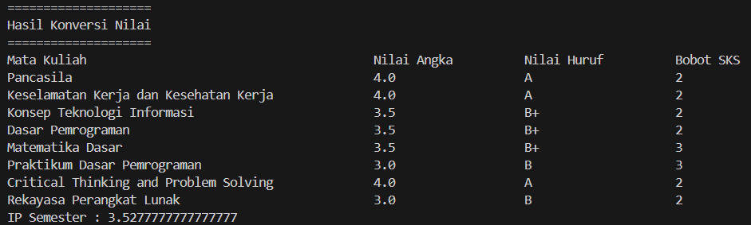

|  | Algorithm and Data Structure |
|--|--|
| NIM |  244107020109|
| Nama |  Aisya Aswy Nur Aidha|
| Kelas | TI - 1H |
| Repository | [link] (https://github.com/Aisyaaswy/ALSD/tree/main/Jobsheet%201) |

# Labs #1 Review Dasar Pemrograman 
#  Praktikum
## 2.2.1 Pemilihan

implementasi solusi terdapat di Pemilihan.java, dan berikut merupakan hasil screenshot hasil.

**Penjelasan :** Terdapat 4 langkah yakni :
1. Inputkan semua nilai
2. Mengecek apakah nilai yang diinputkan merupakan nilai yang valid.
3. JIka nilai tidak valid akan muncul pemberitahuan bahwa nilai yang dimasukkan tidak valid. Sedangkan jika seluruh nilai valid, maka nilai akan diolah dan akan dikonversi ke dalam nilai huruf
4. Lalu menampilkan apakah mahasiswa LULUS/TIDAK LULUS

## 2.3.1 Perulangan

implementasi solusi terdapat di Perulangan.java, dan berikut merupakan hasil screenshot hasil.

**Penjelasan :** Terdapat 6 langkah utama yakni :
1. Inputkan NIM 
2. Mengambil 2 digit terakhir dari NIM yang telah diinputkan 
3. Mengecek apakah 2 digit tersebut < 10 atau tidak
4. Jika < 10 maka angka akan ditambahkan 10
5. Angka ke-6 dan ke-10 tidak akan dicetak
6. Angka ganjil dicetak dengan asteriks(*) sedangkan angka genap akan dicetak sesuai bilangan asli

## 2.4.1 Array

implementasi solusi terdapat di Array.java, dan berikut merupakan hasil screenshot hasil.

**Penjelasan :** Terdapat 5 langkah utama yakni :
1. Membuat array untuk menyimpan data yang telah diinputkan
2. Menginputkan nama Matkul, Nilai Huruf dan juga bobot SKS Matkul 
3. Mengkonversi Nilai Huruf menjadi Nilai Angka
4. Mengolah data yang telah didapat untuk mendapatkan IP semester
5. Menampilkan hasil konversi nilai beserta IP semester mahasiswa

## 2.5.1 Fungsi

implementasi solusi terdapat di Fungsi.java, dan berikut merupakan hasil screenshot hasil.

**Penjelasan :** Terdapat 5 langkah utama yakni :
1. Menginisialisasikan Array yang berisikan stok dan juga harga bunga
2. Menghitung pendapatan setiap cabang
3. Menampilkan pendapatan setiap cabang
4. Mengupdate stok pada sebuah cabang
5. Menampilkan update stok pada sebuah cabang

## TUGAS 1

implementasi solusi terdapat di Tugas1.java, dan berikut merupakan hasil screenshot hasil.

**Penjelasan :** Terdapat 4 langkah utama yakni :
1. Membuat char array untuk menyimpan kode dan kota
2. Menginputkan kode plat
3. Membuat perulangan untuk mencari kode plat yang sesuai
4. Menampilkan output

## TUGAS 2

implementasi solusi terdapat di Tugas2.java, dan berikut merupakan hasil screenshot hasil.

**Penjelasan :** Terdapat 4 langkah utama yakni :
1. Menginputkan panjang sisi kubus
2. Membuat pilihan menu 
3. Membuat fungsi untuk menghitung volume kubus, luas permukaan kubus serta keliling kubus
4. Menampilkan output

## TUGAS 3

implementasi solusi terdapat di Tugas3.java, dan berikut merupakan hasil screenshot hasil.

**Penjelasan :** Terdapat 5 langkah utama yakni :
1. Menginputkan Jumlah Mata Kuliah
2. Membuat array untuk input Mata Kuliah, SKS, Semester, Hari dengan jumlah sesuai input jumlah matkul
3. Membuat menu
4. Membuat fungsi untuk input Mata Kuliah, Menampilkan Seluruh Jadwal, Mencari Jadwal berdasarkan Hari, Semester serta Mata Kuliah
5. Menampilkan output