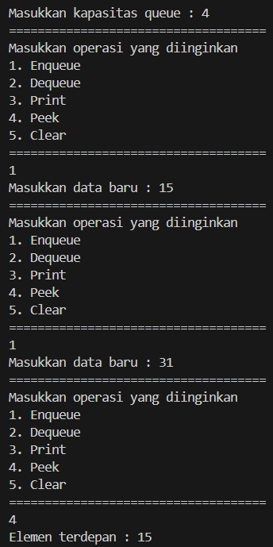
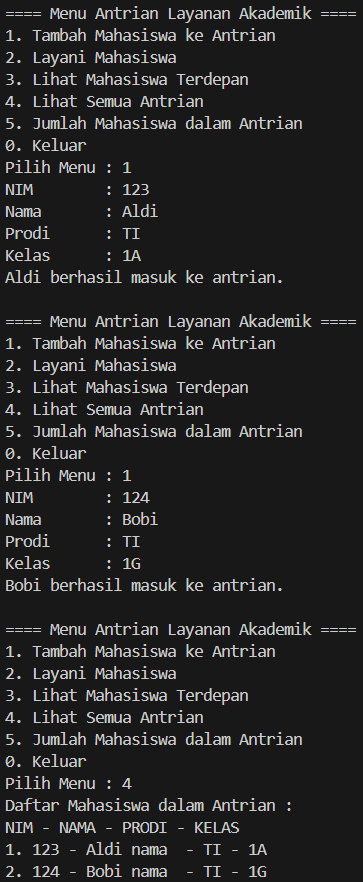
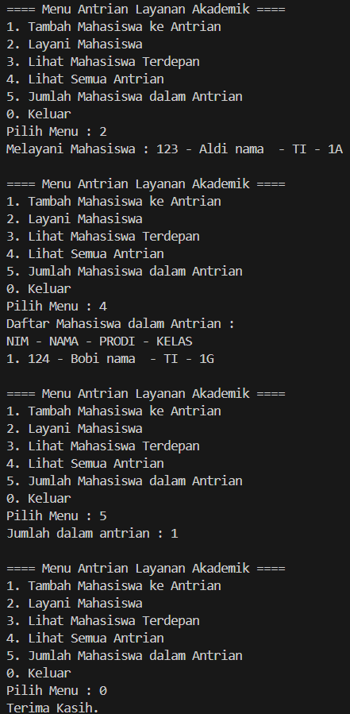

|  | Algorithm and Data Structure |
|--|--|
| NIM |  244109020109|
| Nama |  Aisya Aswy Nur Aidha|
| Kelas | TI - 1H |
| Repository | [https://github.com/Aisyaaswy/ALSD/tree/main/Jobsheet%2010] |

# JOSBHEET X QUEUE
# Praktikum
## 10.1 Percobaan 1 : Operasi Dasar Queue

**10.1.1 Langkah - langkah Percobaan 1 :** 
1. Membuat folder bernama P1Jobsheet10 dan membuat file baru dengan nama ```Queue.java```
2. Menambahkan atribut-atribut sesuai dengan diagram class, kemudian menambahkan juga konstruktor di dalamnya
3. Membuat method ```IsEmpty()``` bertipe boolean untuk mengecek apakah queue kosong 
4. Membuat method ```IsFull()``` bertipe boolean untuk mengecek apakah queue sudah penuh
5. Membuat method ```peek()``` bertipe void untuk menampilkan queue pada posisi paling depan
6. Membuat method ```print()``` bertipe void untuk menampilkan seluruh elemen pada queue mulai dari posisi front sampai dengan posisi rear
7. Membuat method ```clear()``` bertipe void untuk menghapus semua elemen pada queue
8. Membuat method ```Enqueue()``` bertipe void untuk menambahkan isi queue dengan parameter dt yang bertipe integer
10. Membuat method ```Dequeue()``` bertipe int untuk mengeluarkan data pada queue di posisi belakang
10. Membuat class baru dengan nama ```QueueMain.java```, lalu buat method menu bertipe void untuk memilih menu program pada saat dijalankan
11. Membuat fungsi main dan mendeklarasikan Scanner dengan nama sc
12. Membuat variabel n untuk menampung masukan berupa jumlah maksimal elemen yang dapat disimpan pada queue
13. Melakukan inisialisasi objek Queue dengan nama Q dengan mengirimkan parameter n sebagai kapasitas elemen queue
14. Mendeklarasikan variabel dengan nama pilih bertipe integer untuk menampung pilih menu dari pengguna
15. Melakukan perulangan menggunakan do-while untuk menjalankan program secara terus menerus sesuai masukan yang diberikan. Yang didalam perulangan tersebut terdapat pemilihan kondisi menggunakan switch-case untuk menjalankan operasi queue sesuai dengan masukan pengguna
16. Menjalankan class tersebut dan mengamati hasilnya

**10.1.2 Verifikasi Hasil Percobaan**

Hasil run kode program 



**10.1.3 Pertanyaan :**
1. Pada front dan near diberi nilai -1 karena sebagai penanda bahwa queue masih kosong(belum ada elemen sama sekali), sedangkan untuk atribut size bernilai 0 untuk menandakan bahwa tidak ada elemen dalam antrian saat pertama kali dibuat
2. Kode tersebut merupakan bagian dari implementasi struktur data circular queue, kode ini memungkinkan antrian menggunakan seluruh ruang yang tersedia secara efisien dengan cara "melingkar" kembali ke awal array ketika ujung array sudah tercapai, tanpa cilcular queue, jika rear sudah di akhir array maka tidak dapat menambahkan data lagi walaupun masih ada ruang kosong di depan array karena front sudah maju
3. Kode tersebut memungkinkan pointer front "berputar" kembali ke awal array setelah mencapai ujung, sehingga antrian tetap berjalan lancar dalam Circular queue, tanpa logika tersebut antrian akan menjadi statis dan tidak optimal setelah beberapa operasi
4. Proses perulangan variabel dimulai dari front karena front merupakan titik awal elemen aktid dalam antrian, penggunaannya memastikan elemen yang dicetak benar benar isi dan urutan dari antrian saat ini, jika i dimulai dari 0 maka bisa saja mencetak elemen yang sudah tidak aktif lagi(sudah dikeluarkan dari queue) atau bahkan mencetak data kosong yang belum pernah diisi
5. Kode tersebut merupakan implementasi dari circular queue, kode ini mengatur pergerakan indeks secara melingkar dalam array yang berfungsi sebagai antrian
6. Potongan kode program yang menunjukkan queue overflow ada pada method enqueue yakni pada
```java
        if (isFull()) {
            System.out.println("Queue sudah penuh");
        }
```
7. Memodifikasi program agar langsung berhenti ketika terjadi queue overflow dan queue underflow
- Pada method ```Enqueue()```
```java
public void Enqueue(int dt) {
        if (isFull()) {
            System.out.println("Queue overflow! Program berhenti");
            System.exit(1); //menambahkan potongan program berikut agar program langsung berhenti ketika queue underflow
        } else {
            if (isEmpty()) {
                front = rear = 0;
            } else {
                if (rear == max - 1) {
                    rear = 0;
                } else {
                    rear++;
                }
            }
            data[rear] = dt;
            size++;
        }
    }
```
- Pada method ```Dequeue()```
```java
    public int Dequeue() {
        int dt = 0;
        if (isEmpty()) {
            System.out.println("Queue underflow! Program berhenti");
            System.exit(1); // menambahkan potongan program berikut agar program langsung berhenti ketika queue underflow
        } else {
            dt = data[front];
            if (front == max - 1) {
                front = 0;
            } else {
                front++;
            }
        }
        return dt;
    }
```

## 10.2 Percobaan 1 :Antrian Layanan Akademik

**10.2.1 Langkah - langkah Percobaan 2 :** 
1. Membuat folder baru bernama P2Jobsheet10 dan membuat class baru dengan nama ```Mahasiswa```
2. Menambahkan atribut-atribut Mahasiswa beserta konstruktornya
3. Menyalin dan memodifikasi class ```Queue``` yang telah dibuat pada percobaan sebelumnya dengan mengganti nama class menjadi ```AntrianLayanan```, lalu memodifikasi atribut didalamnya;
4. Mengubah tipe int[] data menjadi Mahasiswa[] pada atribut, method ```Enqueue``` dan method ```Dequeue```
5. Memodifikasi method ```peek``` dan ```print``` agar dapat menampilkan antrian layanan paling depan dan menampilkan semua antrian layanan, dan menambahkan method ```getJumlahAntrian``` dengan menampilkan nilai size
6. Membuat class baru dengan nama ```LayananAkademikSIAKAD``` dan menambahkan fungsi main, juga mendeklarasikan Scanner dengan nama sc.
7. Melakukan instasiasi objek ```AntrianLayanan``` dengan nama ```antrian``` dan nilai parameternya merupakan nilai maksimal antrian yang ditentukan (misal = 5)
8. Mendeklarasikan variabel dengan nama pilihan bertipe integer untuk menampung pilih menu dari pengguna
9. Menambahkan kode untuk melakukan perulangan menu sesuai dengan masukan yang diberikan oleh pengguna
10. Compile dan jalankan class ```LayananAkademikSIAKAD``` kemudian mengamati hasilnya

**10.2.2 Verifikasi Hasil Percobaan**

Hasil run kode program 




**10.2.3 Pertanyaan :**

Melakukan modifikasi dengan menambahkan method baru bernama ```LihatAkhir``` pada class ```LayananAkademikSIAKAD``` agar dapat mengecek antrian yang berada pada posisi paling belakang. Juga menambahkan daftar menu untuk memanggil method ```LihatAkhir``` yang telah dibuat
- pada class ```AntrianLayanan```
```java
    public void lihatAkhir() {
        if (isEmpty()) {
            System.out.println("Antrian kosong!");
        } else {
            System.out.println("Mahasiswa paling akhir : ");
            System.out.println("NIM - NAMA - PRODI - KELAS");
            data[rear].tampilkanData();
        }
    }
```
- pada class ```LayananAkademikSIAKAD```
```java
            System.out.println("6. Cek Antrian Paling Belakang");

                case 6:
                    antrian.lihatAkhir();
                    break;
```

**Tugas**
Membutuat program antrian untuk mengilustrasikan antrian persetujuan Kartu Rencana Studi(KRS) Mahasiswa oleh Dosen Pembina Akademik (DPA). Ketika seseorang akan mengantri, maka harus mendaftarkan datanya. Menggunakan method method yang sudah ditentukan di dalam jobsheet
