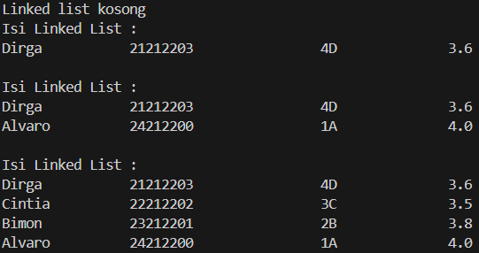

|  | Algorithm and Data Structure |
|--|--|
| NIM |  244109020109|
| Nama |  Aisya Aswy Nur Aidha|
| Kelas | TI - 1H |
| Repository | [https://github.com/Aisyaaswy/ALSD/tree/main/Jobsheet%2012] |

# JOSBHEET XI LINKED LIST
# Praktikum
## 11.1 Percobaan 1 : Membuat Single Linked List

**11.1.1 Langkah - langkah Percobaan 1 :** 
1. Membuat folder bernama Jobsheet12 
2. Menambahkan class class yang telah ditentukan 
3. Mengisikan class ```Mahasiswa03``` dengan diagram class yang telah tersedia
4. Mengimplementasikan class ```Node`` seperti pada yang telah ditentukan
5. Menambahkan atribut head dan tail dalam class ```SingleLinkedList```
6. Menambahkan method ```isEmpty()``` dalam class ```SingleLinkedList```
7. Mengimplementasikan method untuk mencetak dengan menggunakan proses traverse ```print()```
8. Membuat method ```addFirst``` dalam class ```SingleLinkedList```
9. Membuat method ```addLast``` dalam class ```SingleLinkedList```
10. Membuat method ```insertAfter``` dalam class ```SingleLinkedList``` untuk memasukkan node yang memiliki data input setelah node yang memiliki data key
11. Menambahkan method penambahan node pada indeks tertentu ```indeksAt```
12. Membuat fungsi main dalam class ```SLLMain03``` dan membuat objek dari class ```SingleLinkedList```
13. Membuat 4 object mahasiswa dengan nama mhs1, mhs2, mhs3, mhs4 kemudian mengisi data setiap object melalui konstruktor
14. Menambahkan method penambahan data dan pencetakan data di setiap penambahannya agar terlihat perubahannya

**11.1.2 Verifikasi Hasil Percobaan**

Hasil run kode program 



**11.1.3 Pertanyaan :**
1. Pada hasil run kode di baris pertama menghasilkan linked list kosong karena belum terisi
2. Kegunaan variabel temp pada setiap method : 
- ```insertAfter()```
dalam metode ini variabel temp digunakan untuk menelusuri setiap node dari head hingga bertemu node dengan nama yang sesuai key
- ```insertAt()```
dalam metode ini variabel temp merupakan node yang berada sebelum index tujua, untuk menelusuri hingga ke posisi sebelum indeks yang dituju
3. Memodifikasi kode program agar data dapat ditambahkan dari keyboard
