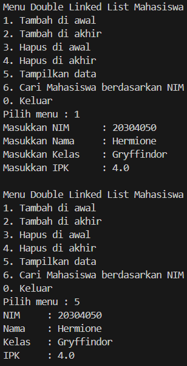
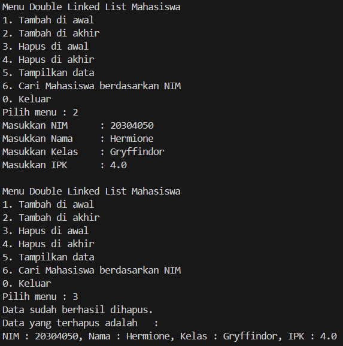

|  | Algorithm and Data Structure |
|--|--|
| NIM |  244109020109|
| Nama |  Aisya Aswy Nur Aidha|
| Kelas | TI - 1H |
| Repository | [https://github.com/Aisyaaswy/ALSD/tree/main/Jobsheet%2012] |

# JOSBHEET XI LINKED LIST
# Praktikum
## 12.1 Percobaan 1 

**12.1.1 Langkah - langkah Percobaan 1 :** 
1. Membuat class baru bernama ```Mahasiswa03```, ```Node03``` dan ```DoubleLinkedLists```
2. Membuat class ```Mahasiswa03``` dan mendeklarasikan atribut sesuai dengan diagram class yang telah ditentukan
3. Membuat class baru dengan nama ```Node03``` dan mendeklarasikan atribut sesuai dengan diagram class yang telah ditentukan
4. Membuat class baru dengan nama ```DoubleLinkedLists``` dan mendeklarasikan atribut sesuai dengan diagram class yang telah ditentukan
5. Membuat konstruktor pada class ```DoubleLinkedLists``` sesuai yang telah ditentukan
6. Membuat method ```isEmpty()``` untuk memastikan kondisi linked list kosong
7. Membuat method ```addFirst()``` untuk menjalankan penambahan data di bagian depan linked list
8. Membuat method ```addLast()``` untuk menambahkan data di bagian belakang linked list
9. Menambahkan kode agar dapat melakukan penambahan data posisi setelah node yang menyimpan data key
10. Membuat method ```print()``` untuk mencetak isi linked lists berapapun isinya 
12. Membuat class  ```DoubleLinkedListsMain``` untuk mengeksekusi semua method yang ada pada class ```DoubleLinkedLists```
13. Membuat menu pilihan pada class main
14. Menambahkan switch case untuk menjalankan menu pilihan tersebut
14. Menambahkan while di bawah switch case dan close untuk menutup object scanner
15. Menambahkan penyesuaian yang terdapat pada kode program

**12.1.2 Verifikasi Hasil Percobaan**

Hasil run kode program 



**12.1.3 Pertanyaan :**
1. Perbedaan Single vs Double Linked List :
- Single Linked List : Setiap node hanya memiliki pointer ke node selanjutnya
- Double Linked List : Setiap node memiliki pointer ke node selanjutnya (next) dan sebelumnya (prev)
2. Atribut next dan prev : 
- Next : Pointer yang menunjuk ke node selanjutnya dalam list
- Prev : Pointer yang menunjuk ke node sebelumnya dalam list
3. Kegunaan konstruktor adalah untuk menginisialisasi head dan tail menjadi null saat membuat object baru
4. Kode tersebut menunjukkan jika linked list masih kosong, maka node pertama (head) dan node terakhir (tail) akan menunjuk ke newNode. Karena hanya ada satu elemen, maka head dan tail adalah node yang sama
5. Statement tersebut digunakan saat list tidak kosong, yang berarti node baru akan disimpan di depan head yang lama maka node yang sebelumnya menjadi head, sekarang harus punya prev (sebelumnya) yang mengarah ke node baru (newNode) 
6. Modifikasi kode program pada fungsi ```print()``` agar dapat menampilkan pesan jika linked list kosong
```java
    public void print() {
        if (isEmpty()) {
            System.out.println("Linked List masih dalam kondisi kosong!");
        } 

        Node03 current = head;
        while (current != null ) {
            System.out.print("NIM : " + current.data.nim + ", Nama : " + current.data.nama + ", Kelas : " + current.data.kelas + ", IPK : " + current.data.ipk);
            current = current.next;
            if (current != null) {
                System.out.println();
            }
        }
    }
```
7. Pada kode tersebut digunakan untuk menghubungkan newNode ke node setelah current 
8. Modifikasi menu pilihan dan switch case agar fungsi ```insertAfter( ``` masuk ke menu
- menu
```java
 do {
            System.out.println("\nMenu Double Linked List Mahasiswa");
            System.out.println("1. Tambah di awal");
            System.out.println("2. Tambah di akhir");
            System.out.println("3. Tambah setelah NIM tertentu");
            System.out.println("4. Hapus di awal");
            System.out.println("5. Hapus di akhir");
            System.out.println("6. Tampilkan data");
            System.out.println("7. Cari Mahasiswa berdasarkan NIM");
            System.out.println("0. Keluar");
            System.out.print("Pilih menu : ");
            pilihan = sc.nextInt();
            sc.nextLine();
```
- pilihan menu
```java
case 3 -> {
            System.out.print("Masukkan NIM setelah mana data akan disisipkan : ");
            String nimKey = sc.nextLine();
            Mahasiswa03 mhs3 = inputMahasiswa(sc);
            list.insertAfter(nimKey, mhs3);
        }

case 7 -> {
            System.out.print("Masukkan NIM yang dicari : ");
            String nim = sc.nextLine();
            Node03 found = list.search(nim);
            if (found != null) {
                System.out.println("Data Ditemukan");
                found.data.tampil();
            } else {
                System.out.println("Data tidak ditemukan");
            }
        }

```

## 12.2 Percobaan 2 : 

**12.2.1 Langkah - langkah Percobaan 2 :** 
1. Menambahkan method ```removeFirst()``` dalam class ```DoubleLinkedList```
2. Menambahkan method ```removeLast()``` dalam class ```DoubleLinkedList```

**12.2.2 Verifikasi Hasil Percobaan**

Hasil run kode program 



**12.2.3 Pertanyaan :**
1. Fungsi kode tersebut adalah menghapus node pertama dari double linked list dengan cara menggeser node ke node berikutnya dan memastikan prev node baru menjadi null.
2. Modifikasi kode program untuk menampilkan pesan "Data sudah berhasil dihapus.  Data yang terhapus adalah...."
```java
        Mahasiswa03 dataYangDihapus = head.data;
        Mahasiswa03 dataYangDihapus = tail.data;
```
```java
        System.out.println("Data sudah berhasil dihapus.");
        System.out.println("Data yang terhapus adalah   : ");
        System.out.println("NIM : " + dataYangDihapus.nim + ", Nama : " + dataYangDihapus.nama + ", Kelas : " + dataYangDihapus.kelas + ", IPK : " + dataYangDihapus.ipk);
```

## Tugas
Membuat kode program dengan ketentuan yang telah ditentukan dalam jobsheet
