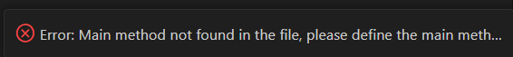
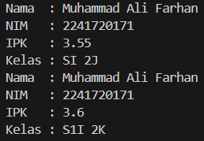
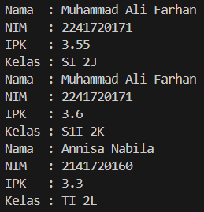
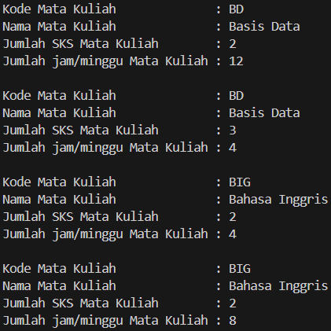
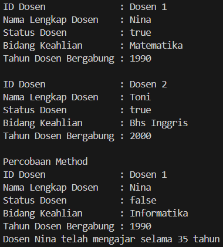

|  | Algorithm and Data Structure |
|--|--|
| NIM |  244107020109|
| Nama |  Aisya Aswy Nur Aidha|
| Kelas | TI - 1H |
| Repository | [link]  |

# Labs #2 OBJECT 
#  Praktikum
## 2.1 Percobaan 1

**2.1.1 Langkah - langkah Percobaan :** 
1. Membuat file baru yang diberi nama Mahasiswa03.java
2. Melengkapi class Mahasiswa dengan atribut yang telah digambarkan di dalam class diagram tersebut.
3. Melengkapi class Mahasiswa dengan method yang telah digambarkan di dalam class diagram tersebut.
4. Compile dan run program

**2.1.2 Verifikasi Hasil Percobaan**

Hasil compile kode program 



**2.1.3 Pertanyaan :**
1. 2 karakteristik dari class atau object merupakan Atribut dan Behavior
2. Pada class Mahasiswa03 terdapat 4 atribut yang dimiliki. Diantaranya :
    - String nama
    - String nim
    - String kelas
    - double  ipk
3. Method yang ada dalam class ini ada 4, yakni :
    - tampilInformasi()
    - ubahKelas(String kelasBaru)
    - updateIpk(double ipkBaru)
    - nilaiKinerja()
4. Modifikasi method updateIpk
```java
void updateIpk(double ipkBaru) {
    if (ipkBaru <= 0.0 || ipkBaru >= 4.0) {
        System.out.println("IPK yang anda masukkan tidak valid!. Masukkan antara 0.0 sampai 4.0");
    } else {
        ipk = ipkBaru;
    }
}
```
5. Cara kerja method nilaiKerja() adalah dengan membandingkan nilai IPK dengan beberapa kategori yang telahh ditentukan menggunakan percabangan if else dengan mengembalikan nilai string sebagai nilai return

## 2.2 Percobaan 2
**2.2.1 Langkah - langkah Percobaan :** 
1. Membuat file dengan nama MahasiswaMain03.java
2. Menuliskan struktur dasar bahasa pemrograman Java yang terdiri dari fungsi main() 
3. Di dalam fungsi main(), lakukan instansiasi, kemudian lanjutkan dengan mengakses atribut dan 
method dari objek yang telah terbentuk. 
4. Compile dan run program. 
5. Commit dan push kode program ke Github

**2.2.2 Verifikasi Hasil Percobaan** 

Hasil compile kode program



**2.2.3 Pertanyaan :**
1. Kode program untuk proses instansi. Nama object yang dihasilkan adalah mhs1.
```java
Mahasiswa03 mhs1 =  new Mahasiswa03();
```

2. Cara mengakses atribut dan bethod dari suatu objek adalah dengan menggunakan (.) setelah objek
3. karena telah dilakukan perubahan pada ipk dan kelas

## 2.3 Percobaan 3
**2.3.1 Langkah-langkah Percobaan :** 
1. Menambahkan dua buah konstruktor di dalam class Mahasiswa
```java
public Mahasiswa03() {
}

public Mahasiswa03(String nm, String nim, double ipk, String kls) {
nama = nm;
this.nim = nim;
this.ipk = ipk;
kelas = kls;
}
```
2. Membuat sebuah object dalam class MahasiswaMain yang bernama mhs2 dengan menggunakan konstruktor berparameter
```java
Mahasiswa03 mhs2 = new Mahasiswa03("Annisa Nabila", "2141720160", 3.25, "TI 2L\n");
mhs2.updateIpk(3.30);
mhs2.tampilkanInformasi();
```
3. Compile dan run program
4. Commit dan push program ke Github

**2.3.2 Verifikasi Hasil Percobaan** 

Hasil compile kode program 



**2.3.3 Pertanyaan :**
1. Baris kode program yang digunakan untuk mendeklarasikan konstruktor berparameter.
```java
public Mahasiswa03(String nm, String nim, double ipk, String kls) {
    nama = nm;
    this.nim = nim;
    this.ipk = ipk;
    kelas = kls;
}
```
2. Pada baris program tersebut melakukan instansiasi dengan konstruktor berparameter dan mendeklarasikan atribut.
3. Jika konstruktor default dihapus maka akan terjadi error, karena jika konstruktor default tidak ada maka konstruktor berparameter akan menjadi konstruktor default sehingga instansiasi harus dengan berparameter.
4. Method dalam class Mahasiswa tidak harus secara berurutan, karena jika suatu method tidak membutuhkan method lain untuk dijalaknkan maka tidak perlu dilakukan secara berurutan, atau sesuai kebutuhan
5. Membuat object baru dengan nama mhsNamaMahasiswa dengan menggunakan konstruktor berparameter.
```java
Mahasiswa03 mhsRani = new Mahasiswa03("Rani", "244107020109", 3.9, "TI 2H");
mhsRani.tampilkanInformasi();
```
6. Commit dan push ke Github

## 2.4 Latihan Praktikum 
**Tugas 1 : Class MataKuliah**

**Hasil run kode program**



**Tugas 2 : Class Dosen**

**Hasil run kode program**



