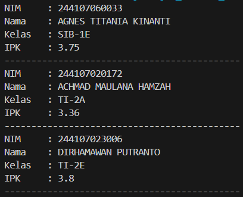
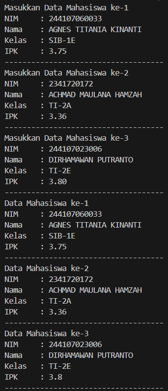
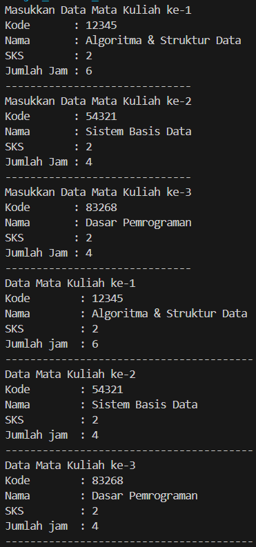
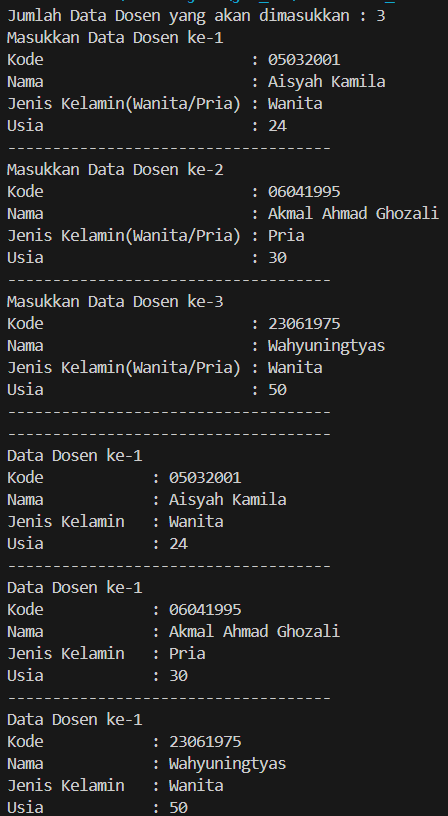
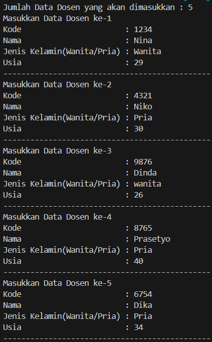
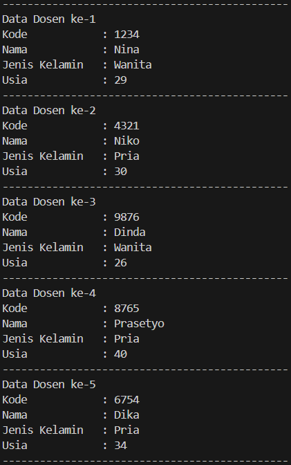
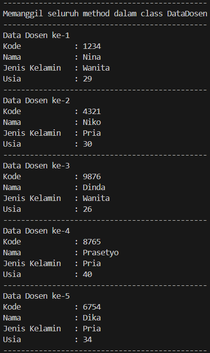

|  | Algorithm and Data Structure |
|--|--|
| NIM |  244107020109|
| Nama |  Aisya Aswy Nur Aidha|
| Kelas | TI - 1H |
| Repository | [https://github.com/Aisyaaswy/ALSD/tree/main/Jobsheet%203] |

# Labs #2 ARRAY OF OBJECTS
#  Praktikum
## 3.2 Membuat Array dari Object, Mengisi dan Menampilkan

**3.2.1 Langkah - langkah Percobaan :** 
1. Membuat folder baru dengan nama Jobsheet 3
2. Membuat file baru yang diberi nama ```Mahasiswa03.java```
3. Membuat class ```MahasiswaDemo.03``` dengan menambahkan fungsi yang telah dicontohkan
4. Mengisikan masing-masing atributnya
5. Mencetak semua atribut dari objek ```arrayOfMahasiswa```
6. Mengamati hasil run program

**3.2.2 Verifikasi Hasil Percobaan**

Hasil run kode program 



**3.2.3 Pertanyaan :**
1. Class yang akan dibuat array tidak harus selalu memiliki atribut sekaligus method. Class dapat hanya memiliki atribut jika hanya digunakan struktur data untuk menyimpan informasi. Method diperlukan jika objek tersebut melakukan operasi tertentu
2. Kode program ```Mahasiswa[] arrayOfMahasiswa = new Mahasiswa[3]``` membuat array arrayOfMahasiswa yang dapat menampung 3 objek Mahasiswa. Namun array tersebut masih kosong sehingga perlu dilakukannya instansiasi
3. Class Mahasiswa03 tidak memiliki konstruktor, tetapi bisa melakukan pemanggilan kontruktor karena program akan membuat konstruktor default secara eksplisit
4. Kode  program tersebut melakukan instansi pada objek array Mahasiswa serta mengisi setiap atribut pada objek Mahasiswa
5. Class Mahasiswa dan MahasiswaDemo dipisahkan untuk membedakan kegunaannya. Class Mahasiswa digunakan untuk menyimpan semua informasi yang berkaitan dengan mahasiswa, sedangkan class MahasiswaDemo untuk memanggil class Mahasiswa dan menggunakan atribut serta method yang ada pada class Mahasiswa

## 3.3 Menerima Input Isian Array Menggunakan Looping

**3.3.1 Langkah - langkah Percobaan  :**
1. Menambahkan Import Scanner pada class MahasiswaDeimo03
2. Memodifikasi kode program yang telah dibuat pada langkah 4 pada percobaan sebelumnya dengan membuat objek Scanner untuk menerima inputan juga melakukan looping untuk menerima informasi terkait dengan mahasiswa
3. Memodifikasi kode program yang telah dibuat pada langkah 5 pada percobaan sebelumnya dengan membuat looping untuk mengakses elemen array objek Mahasiswa dan menampilkan seluruh informasi ke layar
4. Mengamati hasil run kode program

**3.3.2 Verifikasi Hasil Percobaan**

Hasil run kode program



**Pertanyaan :**
1. Menambahkan method ```cetakInfo()``` pada class Mahasiswa dan memodifikasi kode program pada langkah ke-3 
```java
    public void cetakInfo() {
        System.out.println("NIM     : " + nim);
        System.out.println("Nama    : " + nama);
        System.out.println("Kelas   : " + kelas);
        System.out.println("IPK     : " + ipk);
    }
```
2. Ketika menambahkan array baru bertipe ```arrayOfMahasiswa``` dengan nama ```myArrayOfMahasiswa``` seperti kode berikut
```java
        Mahasiswa03[] myArrayOfMahasiswa03 = new Mahasiswa03[3];
        myArrayOfMahasiswa03[0].nim = "244107060033";
        myArrayOfMahasiswa03[0].nama = "AGNES TITANIA KINANTI";
        myArrayOfMahasiswa03[0].kelas = "SIB-1E";
        myArrayOfMahasiswa03[0].ipk = (float) 3.75;
```
karena array ```myArrayOfMahasiswa``` belum dilakukan instansiasi maka akan terjadi error,

## 3.4 Construkctor Berparameter
**Langkah - langkah Percobaan :**
1. Membuat class baru dengan nama ```MataKuliah03``` dengan contructor berparameter
2. Membuat class baru ```MataKuliahDemo03``` dan menambahkan fungsi main() didalamnya. Lalu melakukan instansiasi objek array dengan menggunakan contructor berparameter
3. Run kode program dan mengamati hasilnya. 
4. Memodifikasi class ```MataKuliahDemo03``` sehingga dapat menampilkan hasil inputan variabel array dari objek ```MataKuliah```
5. Run kode program dan mengamati hasilnya.

**3.4.2 Verifikasi Hasil Percobaan**

Hasil run kdoe program



**Pertanyaan :**
1. Suatu class dapat memiliki lebih dari 1 constructor, contohnya
```java
    public MataKuliah03() {
    }
    
    public MataKuliah03(String kode, String nama, int sks, int jmlJam) {
        this.kode = kode;
        this.nama = nama;
        this.sks = sks;
        this.jmlJam = jmlJam;
    }
``` 
dengan menabahkan constructor default pada class ```MataKuliah03```

2. Menambahkan method tambahData() pada class ```MataKuliah03```
```java
    public void tambahData() {
        Scanner sc = new Scanner(System.in);
        System.out.print("Kode        : ");
        this.kode = sc.nextLine();
        System.out.print("Nama        : ");
        this.nama = sc.nextLine();
        System.out.print("SKS         : ");
        this.sks = sc.nextInt();
        System.out.print("Jumlah jam  : ");
        this.jmlJam = sc.nextInt();
    }
```
 dan menggunakannya pada class ```MataKuliahDemo03``` untuk menambahkan data MataKuliah 
```java
    for (int i = 0; i < 3; i++) {
        System.out.println("Masukkan Data Mata Kuliah ke-" + (i + 1));
        arrayOfMataKuliah03[i] = new MataKuliah03();
        arrayOfMataKuliah03[i].tambahData();
        System.out.println("------------------------------------");
    }
```
3. Menambahkan method ```cetakInfo()``` pada class ```MataKulaiah03```
```java
    public void cetakInfo() {
        System.out.println("Kode        : " + this.kode);
        System.out.println("Nama        : " + this.nama);
        System.out.println("SKS         : " + this.sks);
        System.out.println("Jumlah jam  : " + this.jmlJam);
    }
```
 dan menggunakan method tersebut pada class ```MataKuliahDemo``` untuk menampilkan data hasil inputan di layar
 ```java
        for (int i = 0; i < 3; i++) {
        System.out.println("Data Mata Kuliah ke-" + (i + 1));
        arrayOfMataKuliah03[i].cetakInfo();
        System.out.println("------------------------------------");
    }
 ```
4. Memodifikasi kode program pada class ```MataKuliahDemmo``` agar panjang jumlah array dari objek MataKuliah dapat ditentukan oleh user dengan input melalui Scanner
```java
    System.out.print("Jumlah Data Mata Kuliah yang akan dimasukkan : ");
    int jmlData = sc.nextInt();

    MataKuliah03[] arrayOfMataKuliah03 = new MataKuliah03[jmlData];
    String kode, nama, dummy;
    int sks, jmlJam;


    for (int i = 0; i < jmlData; i++) {
        System.out.println("Masukkan Data Mata Kuliah ke-" + (i + 1));
        arrayOfMataKuliah03[i] = new MataKuliah03();
        arrayOfMataKuliah03[i].tambahData();
        System.out.println("------------------------------------");
    }
    for (int i = 0; i < jmlData; i++) {
        System.out.println("Data Mata Kuliah ke-" + (i + 1));
        arrayOfMataKuliah03[i].cetakInfo();
        System.out.println("------------------------------------");
    }
```
## TUGAS
1. Membuat sebuah program untuk menampilkan informasi tentang dosen, dengan menerima input semua informasi terkait dosen dan menampilkannya ke layar. Terdiri dari 2 class yakni : 
    - ```Dosen03```
        
        Berisikan attribute informasi dosen, juga method berkonstruktor
    - ```DosenDemo03```
        
        Class untuk proses input juga menampilkan data yang telah diinputkan dengan menggunakan loop for dan juga for each

Hasil run kode program yang telah dibuat sebagai berikut 



2. Menambahkan class baru bernama ```DataDosen03``` dengan beberapa method seperti :
    - dataSemuaDosen(Dosen03[] arrayOfDosen03)
    - jumlahDosenPerJenisKelamin(Dosen03[] arrayOfDosen03)
    - rerataUsiaDosenPerJenisKelamin(Dosen03[] arrayOfDosen03)
    - rerataUsiaDosenPerJenisKelamin(Dosen03[] arrayOfDosen03)
    - infoDosenPalingMuda(Dosen03[] arrayOfDosen03)

Lalu semua method diatas akan dipanggil pada class ```DosenDemo```

Hasil run kode program yang telah dibuat sebagai berikut




