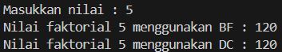
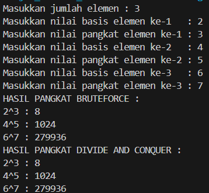
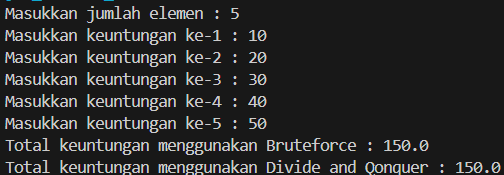

|  | Algorithm and Data Structure |
|--|--|
| NIM |  244107020109|
| Nama |  Aisya Aswy Nur Aidha|
| Kelas | TI - 1H |
| Repository | [] |

# JOSBHEET V BRUTE FORCE AND DIVIDE CONQUER
# Praktikum
## 5.2 Menghitung nilai Faktorial dengan Algoritma Brute Force dan Divide Conquer

**5.2.1 Langkah - langkah Percobaan :** 
1. Membuat folder baru dengan nama Jobsheet 5
2. Membuat class baru dengan nama ```Faktorial```
3. Melengkapi class ```Faktorial``` dengan atribut dan method yang telah digambarkan di dalam diagram class yg telah tersedia
4. Mencoba menjalankan class ```Faktorial``` dengan membuat class baru yakni ```MainFaktorial```
    - Di dalam fungsi main sediakan agar user dapat menginputkan nilai yang akan dicari faktorialnya
    - Kemudian buat objek dari class ```Faktorial``` dan menampilkan hasil pemanggilan method
    - Memastikan program sudah berjalan dengan baik


**5.2.2 Verifikasi Hasil Percobaan**

Hasil run kode program 



**5.2.3 Pertanyaan :**
1. Perbedaan bagian if dan else dalam base line Divide and Conquer
    - Kode if menjadi base case dari rekursi yakni ketika n = 1 maka rekursi akan berhenti dan mengembalikan nilai 1, juga merupakan solusi untuk sub-masalah terkecil
   - Sedangkan dalam penggunaan kode else menggunakan langkah rekursif yakni bagaimana masalah yang lebih besar dipecah menjadi sub-masalah yang lebih kecil, ketika n tidak sama dengan 1 kode ```int fakto = n * faktorialDC(n - 1)``` akan dieksekusi dan akan mengembalikkan hasil perhitungan faktorial  
2. Tetap memungkinkan untuk menggununakan perulangan selain for, sebagai contoh lain dapat menggunakan perulangan while
```java
    int faktorialBF(int n) {
        int fakto = 1;
        int i = 1;
        while (i <= n) {
            fakto *= i;
            i++;
        }
        return fakto;
    }
```
3. Perbedaan antara ```fakto *= i``` dan ```fakto = = n * faktorialDC(n - 1)```
    - ```fakto *= i``` contoh penggunaan dalam metode Brute Force yang menggunakan perulangan (iteratif)
    - ```fakto = = n * faktorialDC(n - 1)``` contoh penggunaan dalam metode Divide and Conquer yang menggunakan rekursi yakni dengan melakukan pembagian masalah dan penggabungan hasil
4. Dapat disimpulkan bahwa perbedaan cara kerja dari masing-masing method yakni:
    - ```faktorialBF()``` : Menggunakan perulangan, tidak ada pemanggilan fungsi tambahan, lebih cepat karena langsung menghitung hasil dalam satu kali perulangan
    - ```faktorialDC()``` : Menggunakan rekursi (pemanggilan fungsi secara berulang), memecah masalah menjadi bagian yang lebih kecil juga memanggil diri sendiri hingga mencapai base case, lebih lambat dari method yang menggunakan Brute Force karena ada overhead pemanggilan rekursif

## 5.3 Menghitung Hasil Pangkat dengan Algoritma Brute Force dan Devide Conquer

**5.3.1 Langkah - langkah Percobaan  :**
1. Membuat class baru dengan nama ```Pangkat``` dan membuat atribut angka yang akan dipangkatkan beserta angka pemangkatnya
2. Menambahkan konstruktor berparameter
3. Menambahkan method ```PangkatBF()``` dalam class tersebut
4. Juga menambahkan method ```PangkatDC()```
5. Memeriksa apakah terdapat kesalahan dalam pembuatan class tersebut
6. Membuat class baru ```MainPangkat``` yang terdapat method main didalamnya. Lalu menambahkan kode untuk menerima inputan jumlah elemen yang akan dihitung pangkatnya
7. Selanjutnya nilai elemen akan digunakan untuk inisiasi array of objek. Menambahkan proses pengisian beberapa nilai yang akan dipangkatkan sekaligus dengan pemangkatnya
8. Kemudian memanggil hasilnya dengan mengeluarkan return value dari method ```PangkatBF()```  dan ```PangkatDC()```

**5.3.2 Verifikasi Hasil Percobaan**

Hasil run kode program



**5.3.3 Pertanyaan :**
1. Perbedaan dalam 2 method yang telah dibuat :
    - Dalam method pangkatBF() menggunakan perulangan(iterasi) yang merupakan contoh penerapan metode Brute Force
    - Sedangkan dalam method pangkatDC() menggunakan rekursi yang merupakan contoh penerapan metode Divide and Conquer
2. Dalam kode tersebut sudah terdapat tahap combine, terdapat 2 kondisi yakni
    - ```return (PangkatDC(a, n/2)*PangkatDC(a, n/2) * a)``` jika n merupakan bilangan ganjil
    - ```return (PangkatDC(a, n/2)*PangkatDC(a, n/2));``` jika n merupakan bilangan genap
3. Meskipun dalam class ```Pangkat``` telah ada atribut ```nilai``` dan ```pangkat```, tetapi method tersebut tetap relevan untuk memakai parameter jika ingin lebih fleksibel dalam pneghitungan pangkat tanpa mengubah atribut class. Dalam method ```PangkatBF``` tetap dapat dibuat tanpa harus menggunakan parameter jika method hanya digunakan dalam objek yang sudah memiliki atribut ```nilai``` dan ```pangkat```. Berikut contoh modifikasi method ```PangkatBF()``` tanpa menggunakan parameter
```java
    int PangkatBF() {
        int hasil = 1;
        for (int i = 0; i < pangkat; i++) {
            hasil = hasil * nilai;
        }
        return hasil;
    }
```
4. Cara kerja dari 2 method berikut
    - ```PangkatBF()``` Menggunakan perulangan untuk mengalikan bilangan sebanyak n kali
    - ```PangkatDC()``` Menggunakan rekursi metode Divide and Conquer dengan membagi mmasalah menjadi lebih kecil, juga terdapat 2 kondisi jika n merupakan bilangan genap dan jika n merupakan bilangan ganjil

## 5.4 Construkctor Berparameter
**Langkah - langkah Percobaan :**
1. Membuat class baru dengan nama ```Sum``` dengan menambahkan konstruktor didalam class tersebut
2. Menambahkan method ```TotalBF``` yang akan menghitung total nilai array dengan iterative
3. Menambahkan juga method ```TotalDC``` untuk implementasi perhitungan nilai total array menggunakan algoritman Divide dan Conquer
4. Membuat class baru yakni ```MainSum``` yang didalamnya terdapat method main dan user dapat menuliskan berapa bulan keuntungan yang akan dihitung sekaligus membuat instansi objek untuk memanggil atribut ataupun fungsi pada class ```Sum```
5. Menambahkan method main untuk array yang akan dihitung untuk menghitung total nilai keuntungan. Array ini merupakan atribut yang terdapat di class ```Sum```, sehingga harus membuat objek Sum terlebih dahulu
6. Menampilkan hasil perhitungan melalui objek yang telah dibuat untuk kedua cara yang ada (Brute Force dan Divide and Conquer)

**5.4.2 Verifikasi Hasil Percobaan**

Hasil run kdoe program



**Pertanyaan :**
1. Variable ```mid```  dibutuhkan untuk membagi titik tengah dalam pembagian array
2.  - statement ```double lsum = totalDC(arr, l, mid);``` untuk melakukan rekursi di bagian kiri atau menghitung jumlah elemen dari indeks ```l``` hingga ```mid```
    - statement ```double rsum = totalDC(arr, mid + 1, r);``` untuk melakukan rekursi di bagian kanan atau meghitung jumlah elemen dari indeks ```mid + 1``` hingga ```r```
3. ```return lsum + rsum``` diperlukan untuk mengembalikan jumlah elemen yang telah dihitung oleh variabel ```rsum``` dan ```lsum```
4.  Base case dari method ```totalDC()``` yaitu berada pada kode 
```java
if (l == r) {
return arr[l];
}
```
5. Jadi cara kerja dari method ```totalDC()``` yakni dengan 
    - Membuat base case agar rekursi berhenti saat hanya tersisa satu elemen dalam array
    - Menentukan pembagian masalah (membagi elemen menjadi 2) dan menghitung jumlah indeks dari masing-masing bagian yang telah dibagi dengan rekursi
    - Lalu memberikan perintah untuk mengembalikan jumlah (combine) elemen yang telah di lakukan pada langkah sebelumnya
**Latihan Praktikum**
- Membuat kode program dimana telah ditentukan nilai dari beberapa mahasiswa dan menentukan Nilai UTS tertinggi beserta terendah menggunakan metode Divide & Conquer, juga menentukan rata-rata nilai UAS dari seluruh mahasiswa yang telah ditentukan menggunakan metode Brute Force