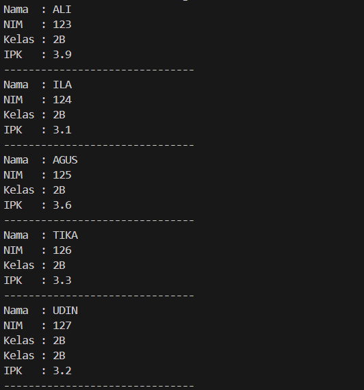

|  | Algorithm and Data Structure |
|--|--|
| NIM |  244107020109|
| Nama |  Aisya Aswy Nur Aidha|
| Kelas | TI - 1H |
| Repository | [] |

# JOSBHEET VI SORTING (BUBBLE, SELECTION DAN INSERTION)
# Praktikum
## 6.2 Mengimplementasikan Sorting menggunakan Object

**6.2.1 Langkah - langkah Percobaan :** 

**a. SORTING - BUBBLE SORT**
1. Membuat folder baru dengan nama Jobsheet 6
2. Membuat class ```Sorting03```, dan menambahkan atribut yang telah ditentukan
3. Menambahkan konstruktor dengan parameter Data[] dan jmlDat
4. Membuat method bubbleSort bertipe void dan mendeklarasikan isinya menggunakan algortima Bubble Sort
5. Membuat method tampil bertipe void dan mendeklarasikan isi method tersebut
6. Membuat class ```SortingMain03``` kemudian mendeklarasikan array dengan nama a[] dan mengisi array tersebut
7. Membuat objek baru dengan nama data dataurut1 yang merupakan instansi dari vlass Sorting, dan mengisi parameternya
8. Memanggil method ```bubbleSort``` dan ```tampil```
9. Menjalankan program dan mengamati hasil

**6.2.2 Verifikasi Hasil Percobaan**

Hasil run kode program 


**b. SORTING - SELECTION SORT**
1. Menambahkan method ```SelectionSort``` yang sudah terimplementasi dari algoritma selection sort ke dalam class ```Sorting03``` yang telah dibuat sebelumnya
2. Mendeklarasikan array dengan nama b[] pada class ```SortingMain03``` dan mengisi array tersebut
3. Membuat objek baru dengan nama dataurut2 yang merupakan instansi dari class sorting dan mengisi parameternya
4. Memanggil method ```SelectionSort``` dan ```tampil```
5. Menjalankan program dan mengamati hasil

**6.2.3 Verifikasi Hasil Percobaan**

Hasil run kode program 


**c. SORTING - INSERTION SORT**
1. Menambahkan method ```InsertionSort``` yang sudah terimplementasi dari algoritma Insertion sort ke dalam class ```Sorting03``` yang telah dibuat sebelumnya
2. Mendeklarasikan array dengan nama c[] pada class ```SortingMain03``` dan mengisi array tersebut
3. Membuat objek baru dengan nama dataurut3 yang merupakan instansi dari class sorting dan mengisi parameternya
4. Memanggil method ```InsertionSort``` dan ```tampil```
5. Menjalankan program dan mengamati hasil

**6.2.4 Verifikasi Hasil Percobaan**

Hasil run kode program 


**6.2.5 Pertanyaan :**
1. Kode program tersebut berfungsi untuk mengurutkan elemen dari yang terkecil ke yang terbesar(ascending) yang menggunakan algoritma Bubble Sort
2. Kode program yang menunjukkan algoritma pencarian nilai minimum pada selection sort
```java
            for (int j = i + 1; j < jumData; j++) {
                if (data[j] < data[min]) {
                    min = j;
                }
            }
```
3. Tujuan dari kondisi pada perulangan ```while (j >= 0 && data[j] > temp)``` untuk memeriksa apakah elemen sebelumnya (data[j]) lebih besar dari elemen yang sedang disisipkan(temp), jika benar maka elemen tersebut perlu digeser ke kanan untuk memberi ruang bagi temp agar tersisip di posisi yg tepat dan proses tersebut akan terus berlanjut ke kiri selama ```j>= 0``` dan nilai sebelumnya lebih besar dari temp
4. Tujuan dari perintah ```data[j + 1] = data[j]``` adalah untuk menggeser elemen yang lebih besar ke kanan dalam algoritma Insertion Sort

## 6.3 Sorting Menggunakan Array of Object
**6.3.2 Langkah - langkah Percobaan :**
1. Membuat class dengan nama ```Mahasiswa03```
2. Membuat class ```MahasiswaBerprestasi03```
3. Menambahkan method ```tambah()```, ```tampil()```, ```bubbbleSoort()``` di dalam class tersebut 
4. Membuat class ```MahasiswaDemo03``` dan menambahkan objek di dalam class tersebut, juga memanggil fungsi yang telah dibuat sebelumnya

**6.3.3 Verifikasi Hasil Percobaan**

Hasil run kode program 


**6.3.4 Pertanyaan :**
1. Perhatikan perulangan di dalam bubbleSort() di bawah ini:
```java
for (int i = 0; i < listMhs.length-1; i++) {
            for (int j = 1; j < listMhs.length-i; j++) {
```

    a. karena setelah n-1 kali iterasi, data sudah pasti terurut sehingga tidak perlu sampai n.
    b. karena setiap putaran iterasi luar(i) akan menempatkan satu elemen terbesar di posisi akhir array, sehingga panjang pengecekan dapat dikurangi karena bagian akhir sudah terurut.
    c. Jika dalam listMhs terdapat sebanyak 50 data, maka akan terjadi perulangan sebanyak 49 kali, dan akan menempuh 49 tahap bubble sort
2. Modifikasi kode program agar data mahasiswa bersifat dinamis
```java
import java.util.Scanner;
public class MahasiswaDemo03 {
    public static void main(String[] args) {
        Scanner sc = new Scanner(System.in);
        MahasiswaBerprestasi03 list = new MahasiswaBerprestasi03();

        System.out.print("Masukkan jumlah data yang ingin dimasukkan : ");
        int jmlData = sc.nextInt();
        sc.nextLine();

        for (int i = 0; i < jmlData; i++) {
            System.out.println("\nData Mahasiswa ke-" + (i + 1));
            System.out.print("Nama Mahasiswa    : ");
            String nama = sc.nextLine();
            System.out.print("NIM Mahasiswa     : ");
            String nim = sc.nextLine();
            System.out.print("Kelas Mahasiswa   : ");
            String kelas = sc.nextLine();
            System.out.print("IPK Mahasiswa     : ");
            double ipk = sc.nextDouble();
            sc.nextLine();
            
            Mahasiswa03 m = new Mahasiswa03(nim, nama, kelas, ipk);
            list.tambah(m);
        }

        System.out.println("\nData mahasiswa sebelum sorting : ");
        list.tampil();
        System.out.println("Data Mahasiswa setelah sorting berdasarkan IPK (ASC) : ");
        list.bubbleSort();
        list.tampil();
        System.out.println("Data yang sudah terurut menggunakan SELECTION SORT (ASC) : ");
        list.SelectionSort();
        list.tampil();
    }
}
```
## 6.4 Mengurutkan Data Mahasiswa Berdasarkan IPK (Selection Sort)
**6.4.1 Langkah - langkah percobaan :**
1. Menambahkan method ```selectionSort()``` pada class ```MahasiswaBerprestasi03``` 
2. Menambahkan baris program untuk memanggil method ```selectionSort()``` dalam method main class ```MahasiswaDemo```, dan memanggil method ```tampil()```
3. Menjalankan program dan mengamati hasil. Data mahasiswa telah tampil urut menaik berdasarkan ipk

**6.4.2 Verifikasi Hasil Percobaan**

Hasil run kode program 




**6.4.3 Pertanyaan :**
1. Kode tersebut untuk mencari indeks data mahasiswa dengan nilai IPK terkecil dari posisi i + 1 sampai akhir array, setelah ditemukan, data IPK terkecil tersebut akan ditukar ke posisi indeks i

## 6.5 Mengurutkan Data Mahasiswa Berdasarkan IPK Menggunakan Insertion Sort
**6.5.1 Langkah - langkah percobaan :**
1. Menambahkan method ```insertionSort()``` pada class ```MahasiswaBerprestasi03``` 
2. Menambahkan baris program untuk memanggil method ```insertionSort()``` dalam method main class ```MahasiswaDemo```, dan memanggil method ```tampil()```
3. Menjalankan program dan mengamati hasil. Data mahasiswa telah tampil urut menaik berdasarkan ipk

**6.5.2 Verifikasi Hasil Percobaan**

Hasil run kode program 


**6.5.3 Pertanyaan :**

Modifikasi fungsi insertionSort agar melakukan proses sorting secara decending
```java
        for (int i = 1; i < listMhs.length; i++) {
            if (listMhs[i] == null) continue; 
    
            Mahasiswa03 temp = listMhs[i];
            int j = i;
    
            while (j > 0 && listMhs[j - 1] != null && listMhs[j - 1].ipk < temp.ipk) {
                listMhs[j] = listMhs[j - 1];
                j--;
            }
            listMhs[j] = temp;
        }
```
**Latihan Praktikum :**
Membuat kode program yang telah ditentukan pada jobsheet 6