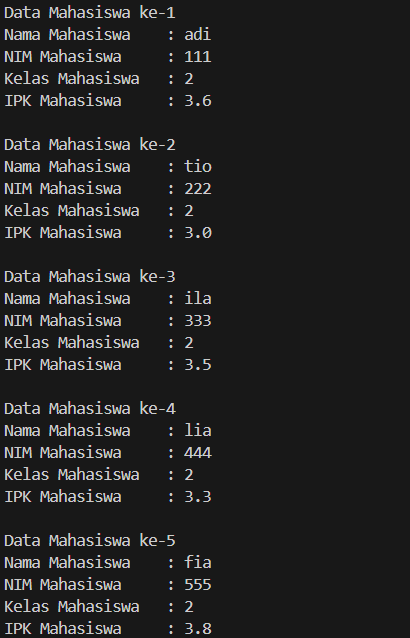
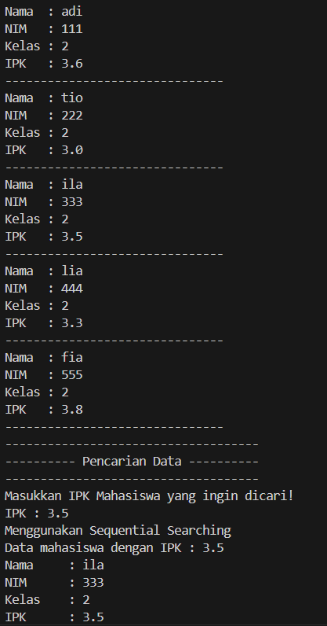
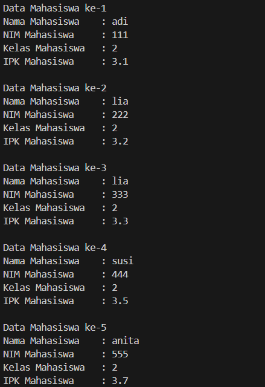
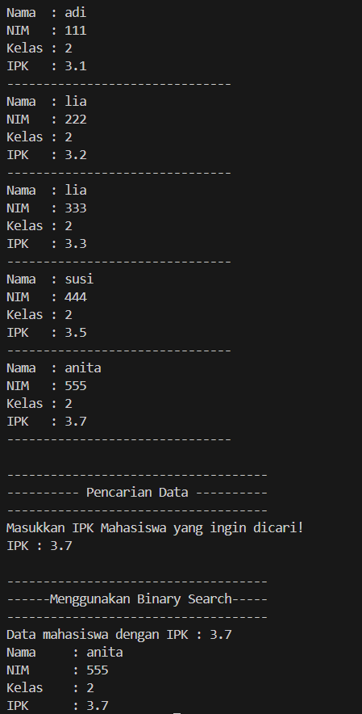

|  | Algorithm and Data Structure |
|--|--|
| NIM |  244107020109|
| Nama |  Aisya Aswy Nur Aidha|
| Kelas | TI - 1H |
| Repository | [https://github.com/Aisyaaswy/ALSD/tree/main/Jobsheet%207] |

# JOSBHEET VII SEARCHING
# Praktikum
## 7.2 Searching / Pencarian Menggunakan Algoritma Sequential Search

**7.2.1 Langkah - langkah Percobaan Sequential Search :** 
1. Menggunakan class ```Mahasiswa03```, ```MahasiswaBerprestasi03``` dan ```MahasiswaDemo03``` pada pertemuan jobsheet 6 sebelumnya
2. Menambahkan method ```sequentialSearching``` dalam class ```MahasiswaBerprestasi03``` 
3. Membuat method ```tampilPosisi``` bertipe void pada class ```MahasiswaBerprestasi03``` 
4. Membuat method ```tampilDataSearch``` bertipe 
void pada class ```MahasiswaBerprestasi03```
5. Menambahkan kode program pada class ```MahasiswaDemo``` untuk melakukan pencarian data dengan sequential searching

**7.2.2 Verifikasi Hasil Percobaan**

Hasil run kode program 




**7.2.3 Pertanyaan :**
1. Perbedaan method ```tampilDataSearch``` dan ```tampilPosisi```
- Method ```tampilDataSearch``` bertujuan untuk menampilkan data lengkap mahasiswa 
- Method ```tampilPosisi``` bertujuan untuk menyatakan apakah IPK ditemukan atau tidak
2. Fungsi break pada kode program tersebut adalah untuk menghentikan perulangan setelah data yang dicari ditemukan 

## 7.3 Searching / Pencarian Menggunakan Algoritma Binary Search
**7.3.1 Langkah - langkah Percobaan Binary Search :** 
1. Menambahkan method ```findBinarySearch``` bertipe int pada class ```MahasiswaBerprestasi```
2. Memanggil method ```findBinarySearch``` terdapat pada class ```MahasiswaBerprestasi``` di kelas 
```MahasiswaDemo```. Kemudian memanggil method ```tampilPosisi``` dan ```tampilDataSearch``` 
3. Menjalankan kode program dan mengamati hasil run

**7.3.2 Verifikasi Hasil Percobaan**

Hasil run kode program 




**7.3.3 Pertanyaan**
1. Kode program yang menjalankan proses divide yaitu
```java
mid = (l + r) / 2;
```
2. Kode program yang menjalankan proses conquer yaitu
```java
return findBinarySearch(cari, l, mid - 1);
return findBinarySearch(cari, mid + 1, r);
```
3. Jika menggunakan Sequential Search maka program akan tetap berjalan tanpa data IPK harus berurutan karena algoritma ini memeriksa satu per satu elemen dari awal sampai akhir. Sedangkan jika menggunakan Binary Search program tidak akan berjalan dengan benar jika belum diurutkan secara ascending terlebih dahulu, karena Binary Search bekerja dengan membagi array secara rekursif berdasarkan posisi tengah sehingga jika tidak urut hasil mid tidak akan merepresentasikan pembagian logis antara elemen kecil dan besar dan menjadikan nilai yang dicari tidak ditemukan.
4. Jika data IPK diurutkan secara descending hasilnya tidak akan sesuai. Modifikasi kode program agar sesuai :
```java
int findBinarySearchDescending(double cari, int l, int r) {
    if (r >= l) {
        int mid = (l + r) / 2;
        if (cari == listMhs[mid].ipk) {
            return mid;
        } else if (listMhs[mid].ipk < cari) {
            // kalau cari lebih besar, geser ke kiri
            return findBinarySearchDescending(cari, l, mid - 1);
        } else {
            // kalau cari lebih kecil, geser ke kanan
            return findBinarySearchDescending(cari, mid + 1, r);
        }
    }
    return -1;
}
```
5. Modifikasi kode program agar jumlah mahasiswa berasal dari inputan user
```java
        System.out.println("Masukkan jumlah data yang ingin dimasukkan ");
        int jmlData = sc.nextInt();
        sc.nextLine();
```
**Latihan Praktikum**
1. Menambahkan beberapa method dan peraturan pada class yang sama pada jobsheet sebelumnya.