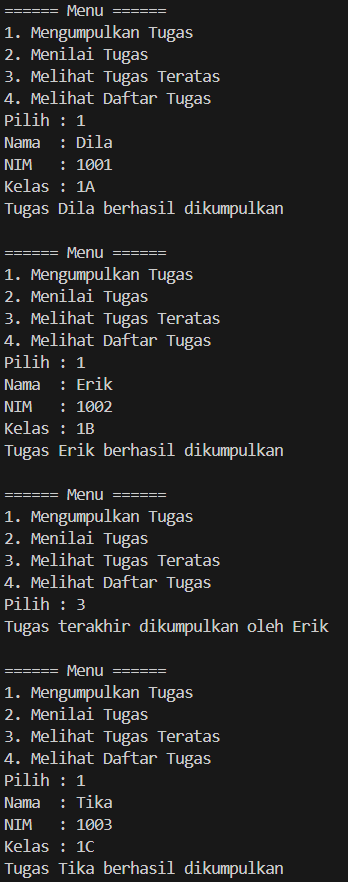
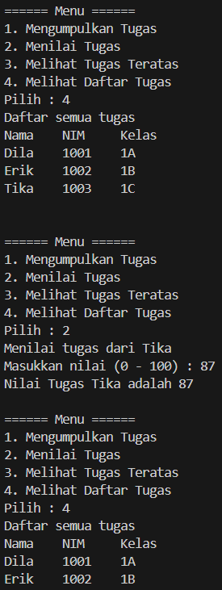
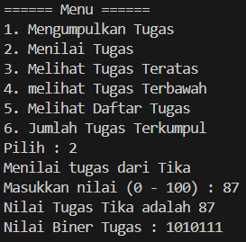
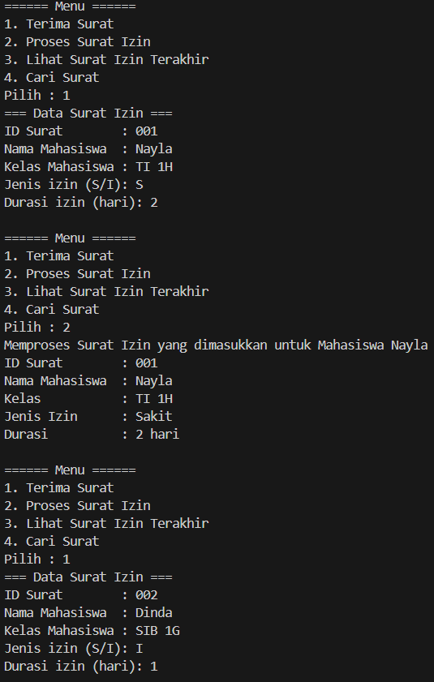
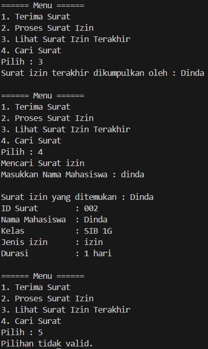

|  | Algorithm and Data Structure |
|--|--|
| NIM |  244109020109|
| Nama |  Aisya Aswy Nur Aidha|
| Kelas | TI - 1H |
| Repository | [https://github.com/Aisyaaswy/ALSD/tree/main/Jobsheet%209] |

# JOSBHEET IX STACK
# Praktikum
## 9.1 Percobaan 1 : Mahasiswa Mengumpulkan Tugas

**9.1.1 Langkah - langkah Percobaan 1 :** 

**A. Class Mahasiswa**
1. Membuat folder bernama Jobsheet 9 dan membuat file baru dengan nama ```Mahasiswa03.java```
2. Melengkapi class Mahasiswa dengan atribut yang telah digambarkan di dalam class diagram mahasiswa, yang terdiri dengan nama, nim, kelas dan nilai
3. Menambahkan konstruktor berparameter pada class Mahasiswa sesuai dengan class diagram Mahasiswa, dan memberikan nilai default nilai =-1 sebagai nilai awal ketika tugas belum dinilai
4. Menambahkan method ```tugasDinilai()``` yan digunakan untuk mengeset nilai ketika dilakukan penilaian tugas mahasiswa

**B. Class StackTugasMahasiswa**


5. Membuat class ```StackTugasMahasiswa03.java``` sebagai temapat untuk mengelola tumpukan tugas. Class ini merupakan penerapan dari struktur data stack
6. Melengkapi class ```StackTugasMahasiswa03.java``` dengan atribut yang telah digambarkan di dalam class diagram ```StackTugasMahasiswa03.java``` yang terdiri dari atribut stack, size dan top.
7. Menambahkan  konstruktor berparameter pada class ```StackTugasMahasiswa03.java``` untuk melakukan inisialisasi kapasitas maksimum data tugas mahasiswa yang dapat disimpan di dalam stack, serta mengeset indeks awal dari pointer top
8. Membuat method ```isFull``` bertipe boolean untuk mengecek apakah tumpukan tugas mahasiswa sudah terisi penuh sesuai kapasitas.
9. Membuat method ```isEmpty``` bertipe boolean untuk mengecek apakah tumpukan tugas masih kosong pada class ```StackTugasMahasiswa03.java```
10. Membuat method ```push``` dengan menerima parameter mhs yang berupa object dari class ```Mahasiswa``` agar dapat menambahkan berkas tugas ke dalam tumpukan stack
11. Menambahkan method ```pop``` untuk mengeluarkan tugas yang akan dinilai. Method ini tidak menerima parameter apapun namun mempunyai nilai kembalian berupa object dari class ```Mahasiswa```
12. Membuat method ```peek``` untuk dapat mengecek tumpukan tugas mahasiswa yang berada di posisi paling atas
13. Menambahkan method ```print``` untuk dapat menampilkan semua daftar tugas mahasiswa pada stack

**B. Class StackTugasMahasiswa**

14. Membuat file baru dengan nama ```MahasiswaDemo03.java```
15. Menuliskan struktur dasar yang terdiri dari dari fungsi main
16. Melakukan instansiasi object StackTugasMahasiswa03 bernama stack dengan nilai parameternya 5 di dalam fungsi main
17. Mendeklarasikan Scanner dengan nama variabel scan dan variabel pilih bertipe int
18. Menambahkan menu untuk memfasilitasi pengguna dalam memilih operasi stack dalam mengelola data tugas mahasiswa menggunakan struktur perulangan do-while
19. Commit dan push kode program ke Github
20. Compile dan run program

**9.1.2 Verifikasi Hasil Percobaan**

Hasil run kode program 




**9.1.3 Pertanyaan :**
1. Agar hasil run sama dengan verifikasi terdapat perubahan pada method print pada class ```StackTugasMahasiswa03.java``` 
```java
        public void print() {
                for (int i = top; i >= 0; i--) {
                    System.out.println(stack[i].nama + "\t" + stack[i].nim + "\t" + stack[i].kelas);
                }
                System.out.println("");
            }
```
2. Jumlah Mahasiswa yang dapat ditampung di dalam stack ada 5 yang teradapat pada baris kode berikut
```java
        StackTugasMahasiswa03 stack = new StackTugasMahasiswa03(5);
```
3. Pengecekan kondisi ```!isfull()``` pada method ```push()``` digunakan untuk mencegah penambahan data stack yang sudah penuh dan jika kondisi tersebut dihapus maka dapat terjadi stackoverflow
4. Modifikasi program agar pengguna dapat melihat mahasiswa yang pertama kali mengumpulkan tugas dalam class ```StackTugasMahasiswa03.java``` dan class ```MahasiswaDemo03.java```
- Dalam class ```StackTugasMahasiswa03.java```
```java
    public Mahasiswa03 peekBottom() {
        if (!isEmpty()) {
            return stack[0];
        } else {
            System.out.println("Stok kosong! Tidak ada tugas yang dikumpulkan!");
            return null;
        }
    }
```
- Dalam class ```MahasiswaDemo03.java```
```java
        System.out.println("4. melihat Tugas Terbawah"); //menambahkan tampilan menu untuk melihat pengumpul tugas pertama


        case 4:
            Mahasiswa03 first = stack.peekBottom();
            if (first != null) {
                System.out.println("Tugas pertama dikumpulkan oleh " + first.nama);
            }
            break;
```
5. Menambahkan method untuk menghitung berapa banyak tugas yang sudah dikumpulkan saat ini
- Dalam class ```StackTugasMahasiswa03.java```
```java
        public int hitung() {
            return top + 1;
        }
```
- Dalam class ```MahasiswaDemo03.java```
```java
        System.out.println("6. Jumlah Tugas Terkumpul"); //menambahkan tampilan menu untuk melihat jumlah tugas yang sudah terkumpul

        case 6 :
            int jmlTugas = stack.hitung();
            System.out.println("Jumlah tugas yang telah terkumpul saat ini ada : " + jmlTugas );
            break;
```
6. Commit dan push kode program ke Github

## 9.2 Percobaan 2 : Konversi Nilai Tugas ke Biner
**9.2.1 Langkah - langkah Percobaan Binary Search :** 
1. Menggunakan class yang telah dibuat yakni ```StackTugasMahasiswa03.java```
2. Menambahkan method ```konversiDesimalKeBiner``` berparameter dan bertipe int, dan membuat class baru yakni ```StackKonversi03.java```
3. Menambahkan method ```isEmpty```, ```isFUll```, ```push``` dan ```pull``` ke dalam class ```StackKonversi03.java```
4. Menambahkan baris kode program pada method ```pop``` di class ```MahasiswaDemo03.java```
5. Compile dan run kode program 
6. Commit dan push kode program ke Github

**9.2.2 Verifikasi Hasil Percobaan**

Hasil run kode program 



**9.2.3 Pertanyaan**
1. Alur kerja dari method ```konversiDesimalKeBiner```
    - Membuat object stack 
    - Membuat perulangan untuk menyimpan sisa pembagian dengan 2 dan akan disimpan ke dalam stack dari bawah ke atas
    -  Mengambil semua angka dari stack ```pop``` dan ditambahkan kedalam string ```biner```
    - Karena stack bersifat LIFO(Last In First Out), sisa pembagian yang paling akhir akan keluar paling pertama sehingga akan menampilkan urutan biner yang benar
    - Terdapat kode return untuk mengembalikan hasil konversi sebagai string biner 
2. Jika terdapat perubahan pada kondisi perulangan dalam method ```konversiDesimalKeBiner``` seperti berikut
```java
        public String konversiDesimalKeBiner(int nilai) {
                StackKonversi03 stack = new StackKonversi03();
                while (nilai != 0) { 
                    int sisa = nilai % 2;
                    stack.push(sisa);
                    nilai = nilai / 2;
                }
                String biner = new String();
                while (!stack.isEmpty()) {
                    biner += stack.pop(); 
                }
                return biner;
            }
```
untuk bilangan postif (nilai > 0), kondisi nilai != 0 dan nilai > 0 akan bernilai true selama nilai belum 0, jadi perulangan akan tetap berjalan selama nilai belum habis dibagi

**Latihan Praktikum :**

Membuat program untuk mahasiswa saat mengajukan surat izin.
Berikut contoh output yang dihasilkan


